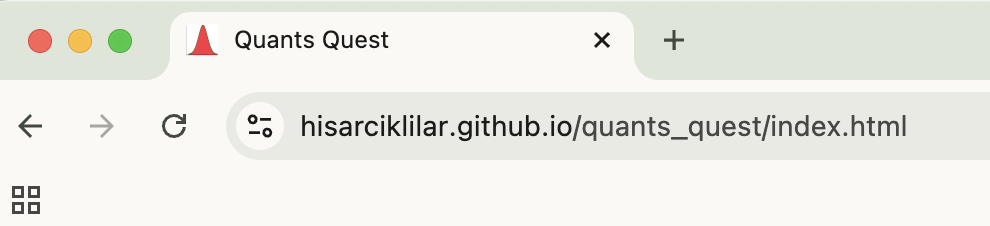
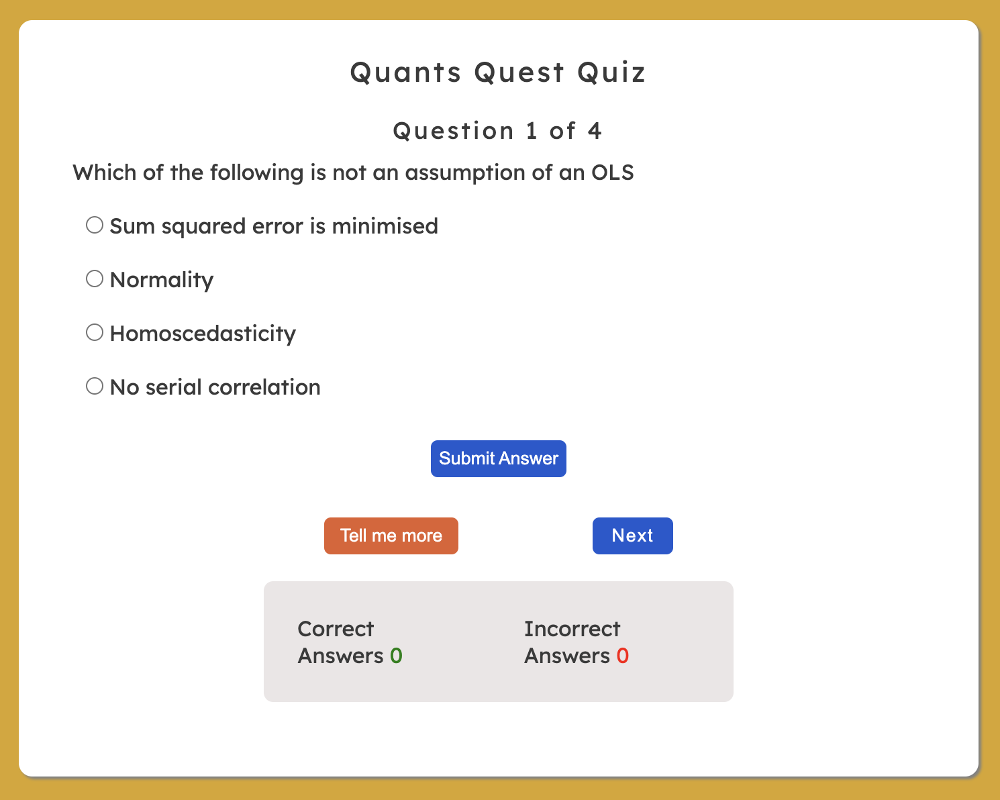
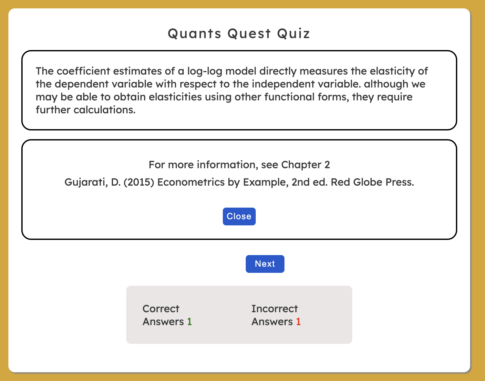
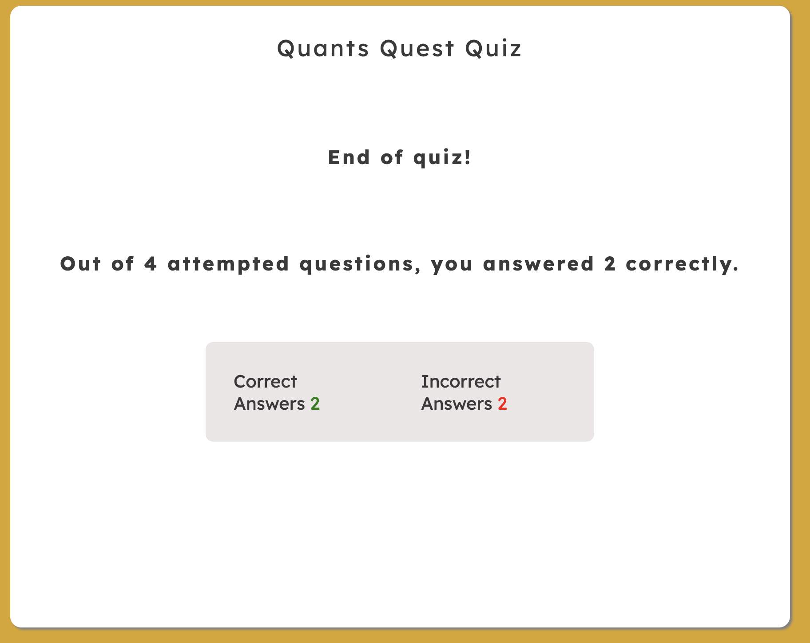
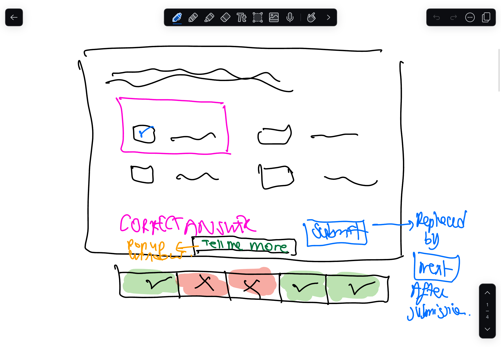
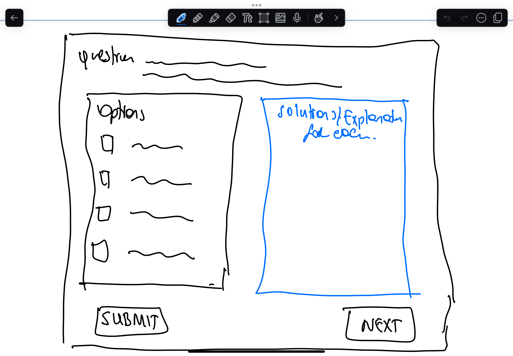
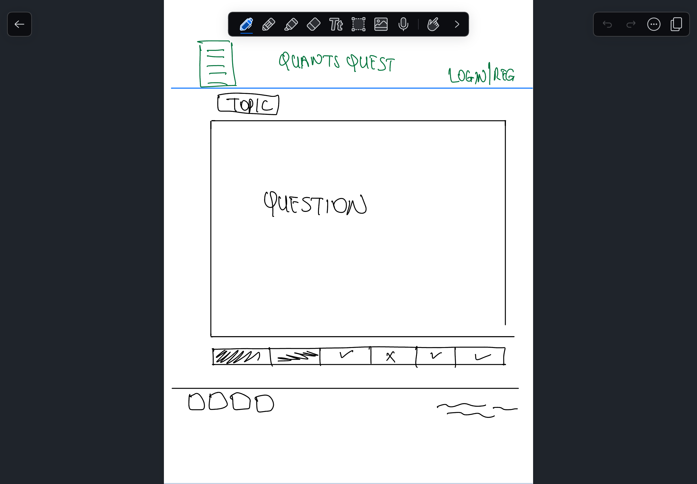
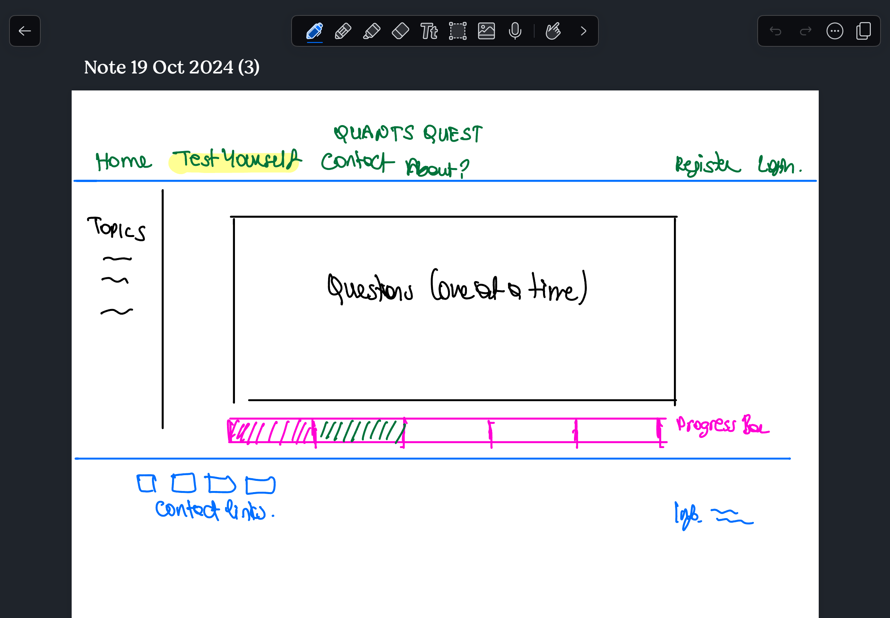

# Quants Quest

__Quants Quest__ is a web application designed for learners of Econometrics at  the beginner to intermediate level. By the use of a multiple choice quiz, it tests the knowledge of users for the basic but most crucial concepts in Econometrics. 

The application targets undergraduate students who are about to start the final year of their degree, although the usage is open to anybody who might be interested with quantitative analysis. 

The designer's aim is to test the user's knowledge on the basic concepts of Econometrics and teach them correct applications through an online interactive quiz while encouraging them to read further on the topic. This is to ensure that users understand the basics before moving on to more advanced topics in their final year. 

An interactive multiple choice quiz is used with an intention of breaking the anxiety around the learning and application of Econometric methods.

_Note_: Above images are obtained through http://ami.responsivedesign.is/

## User Experience

The target audience for this website are UG students of social sciences, who are half-way through their degree. 

### User Stories

Users of this web application expect the following: 

- Navigate around the site easily without frustration.
- Easily read and understand  the information provided in the pages. 
- Can see and assess their own performance and knowledge of Econometrics.
- Can easily find further information on the topic.
- Can easily find further information on the sources to check for further reading and practice. 
- Have an understanding of which topics gain priority for revision.
   
### Site Owner's Goals

I aim to break the anxiety around learning and application of econometrics by 

- creating a warm, welcoming page 
- help users practice what they learnt and learn new concepts through a quiz by 
  - selection of concepts and topics used in quiz questions 
  - providing further information on these
  - providing direction for further reading
 
### Features

#### Design

- A minimalist design is adopted to help users focus on the quiz and not get distracted by other elements on page. 

- Special care is taken to make the navigation as easy for the users as possible. 

#### Color Scheme

The background color chosen for this web application is goldenrod and white for the following reasons:

- Both these colors are not tiring the eye during longer durations of page use; 
  - white forms a good contrast with black and gray tones
  - white space in quiz space allows users to concentrate on question
  - the yellow color is intended to create warm and positive feelings on the user while a slightly darker tone avoid the discomfort of brightness.
- Elements that relate to correct answers are provided in green, while elements that relate to incorrect answers are provided in red. For example, the feedback messages, and the score board. 
- Neutral elements are mainly provided in blue, except for the "tell me more" button, which is coral to differentiate it from the other buttons. 
 
#### Fonts

The following fonts are used:  

- "Lexend" for the body and footer text. "Lexend" is chosen for the main text because a small scale study has shown that people can read and understand more easily when this font style is used.  

- "Rock Salt" is used for heading level 1. It looks dynamic, matching the attributes of a quiz.

#### Link on header 

The header has a link on it that takes the user to the start page (index.html).

#### Favicon

- The normal distribution is chosen as the favicon for this website due to 
  - it being the most widely used distribution in econometrics, and 
  - its simplicity, allowing for an easy recognition even when it is tiny. 

- The area under the normal distribution curve is shaded in red to introduce a greater contrast with the white background.

#### Landing page image

The image used in the landing page is a combination of scatterplots, referred to as Alberto Cairo's "Datasaurus Dozen". This was inspired by Anscombe's quartet, which was constructed in 1973 to show the importance of data visualisation. Data for all scatter plots, including the dinosaur, come from datasets that share the same descriptive summary statistics, yet demonstrate very different patterns. 

It is used here for users to have a better understanding of the importance of data visualisation.      

#### Buttons

- Buttons used throughout the application change color when user hovers over them. This ensures the user that they are clicking on the correct spot. 

#### Create Username

- The "create username" button on the landing page replaces the current window with a small form. 
- Users are asked to type their user names twice. this double-entry is used to check the validity and ensure that there no unintentional typos.
- Users are required to choose a username that is 8 to 10 characters long. This is also checked and validated in the code. 
- Users receive an alert on their screen when 
  - the two usernames they typed do not match
  - when the user name they chose is either less than 8 or more than 10 characters long. 

#### Quiz Page Navigation

Navigation through the quiz pages is guided by 3 buttons: 

- Submit answer
- Next
- Tell me more

  

  

 

 

### Wireframes

I mostly worked on hand-written wireframes as it was easier to draw quickly. A few screenshots are presented below. These were used during the initial stages of idea generation. 

 
 
 

 
 
 

## Testing

### Validator Testing

#### Testing of HTML Pages

- Testing is done using the [W3C HTML Validator](https://validator.w3.org/nu/)
- There were no issues in either the index.html or the quiz.html pages. 

#### Testing of the CSS Page

- Testing is done using the [Jigsaw CSS Validator](https://jigsaw.w3.org/css-validator/)
- No errors were found. 

#### Testing of the js pages

- Testing is done using the [Jshint](https://jshint.com) linter

- No errors were found for the index.js and script.js pages, although there were some warnings about the use of syntax for some browsers.

The metrics are presented below

__Metrics (index.js page)__ 

- There are 6 functions in this file.
- Function with the largest signature take 1 arguments, while the median is 0.5.
- Largest function has 9 statements in it, while the median is 4.
- The most complex function has a cyclomatic complexity value of 2 while the median is 2.

__Metrics (script.js page)__

- There are 15 functions in this file.
- Function with the largest signature take 1 arguments, while the median is 0.
- Largest function has 15 statements in it, while the median is 3.
- The most complex function has a cyclomatic complexity value of 5 while the median is 1.

### Lighthouse

index.html and quiz.html files are tested using lighthouse in each of the following options:
- mobile
- desktop

#### Lighthouse: mobile

Both pages receive high score for all aspects when tested for the mobile platform. 

#### Lighthouse: desktop

Both pages receive score of 100 for all aspects when tested for the desktop platform. 

### Manual Testing

The pages and functionality are tested on the following platforms: 

- OS:
  - Debian GNU/Linux 12 (bookworm):
    - Mozilla Firefox 128.3.1esr (64-bit)
    - Chromium Version 130.0.6723.58 
    - Konqueror Version 22.12.3
  - macOS Sequoia:
    - Google Chrome Version 129.0.6668.101 (Official Build) (arm64)
    - Safari Version 18.0.1 (20619.1.26.31.7)  

- Android 14
  - Mozilla Firefox 131.0.3
  - Google Chrome 130.0.6723.73

- iOS 17.6.1 
  - Safari
- iPadOS 17.6.1
  - Safari

- The following issue is encountered for the "create username" and "start the quiz" links on the landing page: 
  - The links work in all platforms tested, except Chromium Version 130.0.6723.58 running on Debian GNU/Linux 12 (bookworm).

#### Manual Testing: Index Page

| Feature being tested | Expected Outcome | Testing Performed | Actual Outcome | Result (Pass or fail) |
| -------------------- | ---------------- | ----------------- | -------------- | --------------------- |
| "Create username" button | Replace the main body with a small form asking user to create a username | Clicked on the button | Replaced the main body with the username create form | Pass |
| "Create" button | (a) Checks the validity of the username by comparing the values in two input fields; (b) alerts an error message if the two inputs do not match; (c) checks the validity of the username in terms of length (see row below) and then shows a confirmation message to user if the two inputs match with the correct length | (1) entered matching usernames in the input fields; (2) entered non-matching usernames in the input fields | (1) Receive an alert warning about validity of username inputs when the entries were different; (2) The form in main body is replaced with a text confirming username when the username entries match (and if they have between 8 to 10 characters). It also provides a working link to the start of the quiz page. |   Pass |
| "Create" button | Once the equality of two username values is confirmed (see previous row), a check on the length of the username is performed. User receives an alert if the username is shorter than 8 and longer than 10 characters. Confirmation of username replaces the main body if validity is confirmed. | Entered matching usernames that were (1) between 8 to 10 characters long; (2) shorter than 8 characters; and (3) longer than 10 characters | (1) Confirmation of username replaces the main body when the username has the correct length; (2 & 3) Receive an alert when the username is either too short or too long;  | Pass |
| "Start the quiz" button | Calls the quiz page, which reveals the first question and its options. | Clicked the "start the quiz button"  | Index page is replaced by the quiz page | Pass |

#### Manual Testing: Quiz Page

| Feature being tested | Expected Outcome | Testing Performed | Actual Outcome | Result (Pass or fail) |
| -------------------- | ---------------- | ----------------- | -------------- | --------------------- |
| Cursor's look during option selection | Cursor changing to pointer on any text area for the options (answer selection)  | Move cursor over answer option text | Cursor changes to pointer when over text | Pass |
| Radio buttons | Allow single option selection by the user| Select different answer options to see if selection is active in last clicked button | Only  a single option selection is allowed | Pass |
| "Submit answer" button  | A positive or negative feedback provided below question options indicating whether or not the submitted answer is correct | (1) Selected wrong answer to see the negative feedback text; (2) Selected correct answer to see the positive feedback text | Positive or negative feedback appears below options with a text, a small icon and color differentiation | Pass |
| "Submit answer" button:  Disable multiple submits to the same question  | Users cannot locate the submit button once they submit their answer  | Chose correct and then incorrect answers and click submit button | Submit button hidden from page | Pass |
| "Submit answer" button: Correct and Incorrect answer tally updated on click| Users see the updated number of correct answers and number of incorrect answers at the bottom of the quiz area   | Selected correct and incorrect options and clicked submit to observe the change in reported scores at the bottom of the page  | (1) Correct answers score (displayed in green colour) increments by one once the user submits correct answer; (2) Incorrect answers score (displayed in red colour) increments by one once the user submits incorrect answer    | Pass |
| "Tell me more" button  | Further information is displayed to users about the knowledge being tested and the book source to check for more reading.  | Clicked on "tell me more" button after submitting answers to each question in quiz  and checked if the correct information text and correct book chapter is displayed  | Correct information and book chapter are displayed after a click of "tell me more button" | Pass |
| "Tell me more" button: Hide question and its options as well as the positive/negative feedback from users | Quiz question and the feedback on submission are hidden from user, allowing them to focus on the information block | Clicked on "tell me more" button after submitting answers to each question in quiz  and checked if the question and feedback text are hidden  | Question and feedback texts are hidden while displaying more information on the question's topic | Pass |
| "Tell me more" button: Hidden from user on click |  "Tell me more" button is hidden from user once the information is displayed after a click on the same.  This ensures users not getting confused about this button as the information is already displayed to them. | Clicked on "tell me more" button after submitting answers to each question in quiz and checked if the button is hidden on click | Button hidden from display while information is displayed for the user | Pass |
| "Close" button in information area | Information text hidden from user while "tell me more" button and the question & options are visible again once the user closes the information window.  | Clicked on "close" button while information was on display | Information area is hidden from display while users once again see the question & options and the "tell me more" button | Pass |
| "Next" button" | (1) If not at the end of quiz: New question & options displayed to user and the "submit" button is visible again (2) If at the end of quiz: end of quiz message with the final score is displayed to user while hiding all buttons (i.e. "submit", "tell me more", "next") | Moved on to the end of quiz by clicking next and checked if the message appears after last question | End of quiz message and the final scores are displayed to user while hiding the "submit", "tell me more", "next" buttons   | Pass |
| "Next" button : Hide positive/negative feedback on the last attempted question | The positive/negative feedback provided for the last attempted question disappears from page once user clicks "next" to work on the next question | On submission of an answer to a question, clicked on the "next" button (1) after using the "tell me more" button; (2) without using the "tell me more" button and checked if the feedback is hidden | Positive/negative feedback on last attempted question disappears from the user's sight on click to "next" button | Pass |
| Score calculations | (1) Correct and incorrect answer tally provided at the bottom of the page throughout the quiz; (2) Correct number of attempted questions and number of correct answers are calculated and provided to user in the end-of-quiz message    | Selected different combinations of correct and incorrect answers and checked the score calculations throughout. Also did this while skipping some questions. | Correct numbers of (i) correct answer tally; (2) incorrect answer tally; (3) total number of attempted questions are calculated and reported in relevant places.  | Pass |
Link on the header of the page | Replaces the quiz.html with the landing (index) page by calling the index.html file | Clicked on the "Quants Quest" header | Main body of the quiz is replaced by the index.html file|Pass|

### Unfixed Bugs

- Although the page creates a username and checks its validity for typos and character length, the username cannot be fully utilised in quiz because it is only saved locally. This could be changed by saving user details (as well as their past scores) in a database. 
 
## Future Additions
- A visual progress bar at the bottom of the question area
- A more informative message at the end of the quiz, evaluating the performance of the users (possibly through an if condition where the number of correct answers are related to different levels of performance (poor, medium, high, etc)).
- Addition of new sets of questions by topic. 
- Students to be given the ability to choose which topic to practice. 
- Random question reveal from a bigger pool of questions so that users can repeatedly take the quiz but not face the same set of questions every time.   
- Merging the index.js and quiz.js files under one Javascript file. 

## Deployment

The site was deployed to GitHub pages. The steps followed to deploy are as follows:
- In the GitHub repository, go to the Settings tab
- Under "Code and automation", select "Pages" and choose "main" as the default branch
- Once the main branch is selected, the deployment will take place automatically. This may take a few minutes. 
- At the top of the refreshed page, one can find the link to the deployed page. 
- The live link for this project can be found here: 
   https://hisarciklilar.github.io/quants_quest/index.html

The screenshots below show the stages described above: 

## Creating a Fork

Users may fork this repository by navigating to "Fork" and selecting "Create a new fork". One cannot fork from their repository. Hence, below, a screenshot of how this could be done are provided using a repository created by a different user:

## Cloning a Repository

Users may clone this repository by navigating to "Code" and copying the clone link. This link then can be used in Gitpod or a local code editor.  A screenshot of the links are provided below:

(Please note this is not the only way to clone a repository)

## Credits

### Platform Name 
- _Quants Quest_ was suggested by  Microsoft Co-Pilot as the web platform name. 

### Favicon

- Favicon is created from a png file using  [https://favicon.io/](https://favicon.io/). The picture file used is created by me on my tablet. 
  
-  The code on the head of the html files to insert favicon are copied from two sources: 
  - Love running walkthrough example
  - [How to Add a Favicon in HTML: Your Easy Step-by-Step Guide](https://www.html-easy.com/learn/how-to-add-a-favicon-in-html/) by Cristian G. Guasch. [Accessed 13 September 2024]  
  
### Fonts

- Text-based fonts used in this project are downloaded from [Google Fonts](http://fonts.google.com). 

- The social media and other symbols used on pages are from [Font Awesome](https://fontawesome.com/).
   
### Code
- eventListeners in Javascript files are added using the logic provided in love-maths walkthrough example.
- The idea of using "querySelectorAll" method and ".checked" property in the checkAnswer() function code (in script.js file) is taken from an example provided in the following page: https://www.javascripttutorial.net/javascript-dom/javascript-radio-button/
- The idea of getting dynamic values (such as question number, latest score, etc) from the webpage elements rather than using global variables in the javascript file is from Code Institute's love-maths walkthrough example. 
- The idea of using localStorage to store username was based on a discussion that I had with my mentor (Matt Bodden) during our second meeting for this project 
- The code I used for localStorage is written using a few sources:
  - The information and examples provided on https://www.w3schools.com/html/html5_webstorage.asp, and 
  - using examples from "Getting Form Values" and "Form Submission" modules on Code Institute learning pages.
- The design and logic of the score area is taken from Code Institute's love-maths walkthrough example, although the code used for this area in this project is different than the love-maths example.

### Images

- Alberto Cairo's "Datasaurus Dozen" image is obtained through 
  
  Matejka, J. and Fitzmaurice G. (2017). Same Stats, Different Graphs: Generating Datasets with Varied Appearance and Identical Statistics through Simulated Annealing.  Available at <https://www.autodesk.com/research/publications/same-stats-different-graphs> [Accessed 11 January 2022]
- [tinyjpg](https://tinyjpg.com) platform is used for compressing images for uploads

## Acknowledgements

I extend my thanks to my mentor Matt Bodden, for the information and guidance that he provided during our mentoring sessions. My conversations with him helped to shape this web application and more importantly, to resolve some issues that I faced while working on the project. 

I thank my partner Robert Riegler who kept testing the pages as I worked on them using his own gadgets. This allowed me to perform the tests on different brands of electronic gadgets and different operating systems.  
  